# 🛡️ Snort 3 IDS Lab – Detecting Unauthorized Remote Access

This project documents the full installation and configuration of **Snort++ (3.7.2.0)** on **Kali Linux**, compiled from source and enhanced with `snort3_extra`.

This lab attempts to simulates a realistic environment for traffic monitoring and alerting.

---

## 🎯 Objectives

- Compile and install Snort 3 from source
- Enable packet capture support
- Install `snort3_extra` modules for advanced inspection
- Simulate remote access attempts between VMs
- Build a detection-ready IDS

---

## 🧪 Environment

| Component       | Setup                                   |
|----------------|------------------------------------------|
| OS              | Kali Linux (Attacker + Target VMs)      |
| Hypervisor      | VirtualBox                               |
| Network Mode    | Host-only Adapter                        |
| IDS Tool        | Snort++ 3.7.2.0                          |

---

## 📸 Installation Steps (Visual Walkthrough)

### 1. Virtual Machine Setup  
Creating two virtual environments based on Kali Linux (one for IDS and analysis purposes and the other to create network traffic attempting to connect to the first machine) and launching the defending machine.

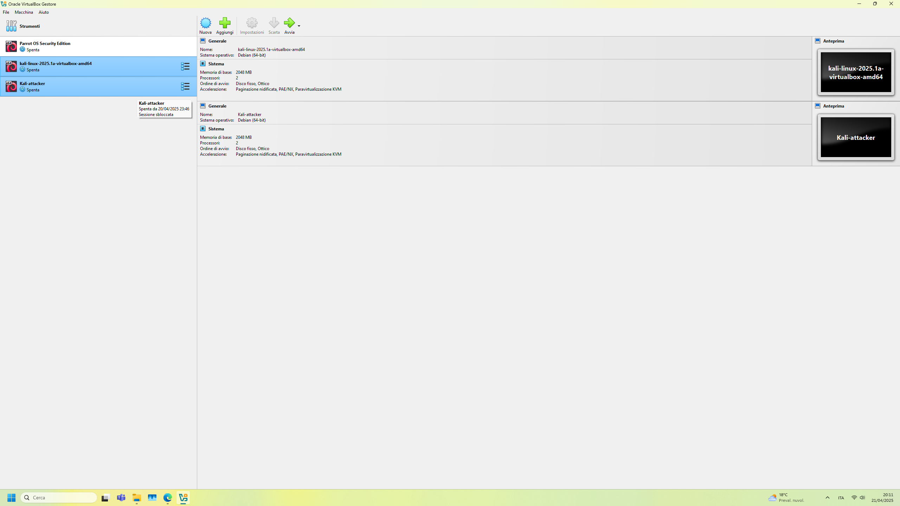

---

### 2. System Update  
Updating Kali Linux to ensure compatibility and stability before building Snort and its dependencies.

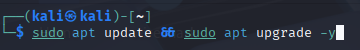

---

### 3. Installing Dependencies  
Installing all necessary development tools and libraries (compilers, network capture libs, LuaJIT, etc.) required for compiling Snort and DAQ from source.

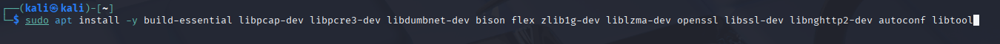

---

### 4. Downloading Snort, DAQ and Extras  
Downloading and extracting the Snort 3, DAQ 3.0.19 and snort3_extra source files.

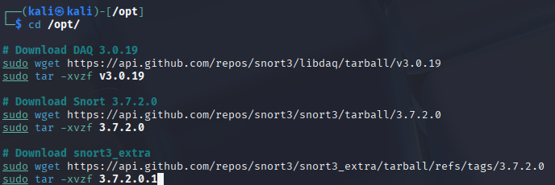

---

### 5. Compiling and Installing DAQ  
Compiling and installing **libdaq version 3.0.19** from source. This step enables Snort to interface with different packet acquisition methods (like `pcap`, `afpacket`, `nfq`, etc.), which are essential for capturing and inspecting live network traffic.

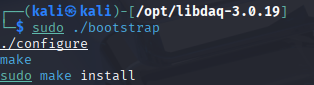

---

### 6. Configuring Snort with CMake  
Preparing the Snort 3 build environment using its custom configuration script to generate the required CMake structure and enable optional features such as tcmalloc — a high-performance memory allocator that reduces memory fragmentation and improves allocation speed, especially in multi-threaded environments. This optimization is particularly beneficial for Snort, which processes high volumes of packets and performs intensive rule-matching operations in real time.

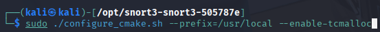

---

### 7. Building Snort  
Compiling the Snort engine source code into executable binaries using the generated CMake files.

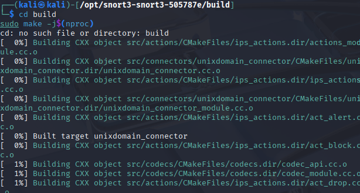

---

### 8. Installing Snort  
Installing the compiled Snort binaries and libraries into the system path (/usr/local) and updating the dynamic linker cache.

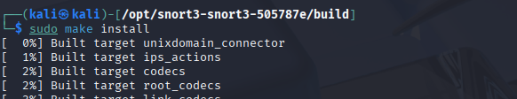

---

### 9. Post-install Configuration  
Running `ldconfig` to refresh shared library links after installing Snort. This ensures all dependencies (like DAQ modules) are correctly linked when Snort is executed.

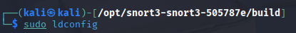

---

### 10. Compiling snort3_extra  
Building the snort3_extra modules which include additional protocol parsers and enhancements to extend Snort’s detection capabilities.

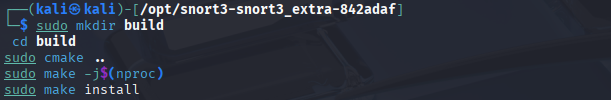

---

### 11. Installing snort3_extra  
Installing the compiled snort3_extra modules into the system to be available for use by Snort during runtime.

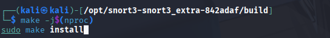

---

### 12. Testing Snort  
Running Snort with the validated Lua configuration to ensure that the engine initializes correctly and the DAQ modules are loaded successfully.

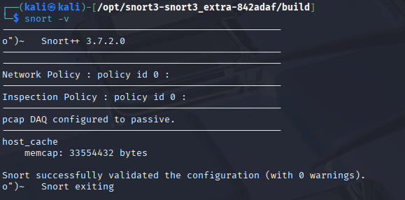

---

## ✅ Final Outcome

- ✅ Snort 3 built and installed successfully
- ✅ DAQ with `pcap` module fully working
- ✅ snort3_extra modules installed and ready
- ✅ Lab environment prepared for live testing and rule development

---
🔐 Custom SSH Rule Setup and Testing with Snort 3
This section documents the creation of a custom Snort 3 rule to detect SSH connection attempts, including configuration and validation steps with illustrative screenshots.

1. Checking the Rules File Existence
We verify the presence of Snort configuration files under /usr/local/etc/snort.

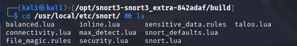

2. Creating the Rules File
We create the rules directory and the custom.rules file for our custom SSH detection logic.

3. Opening the Rules File with Nano
We edit the custom.rules file using nano.

4. Writing the SSH Detection Rule
We insert a rule that alerts on any TCP connection targeting port 22.

alert tcp any any -> any 22 (msg:"[SSH DETECTED] SSH connection attempt detected"; sid:1000001; rev:1;)
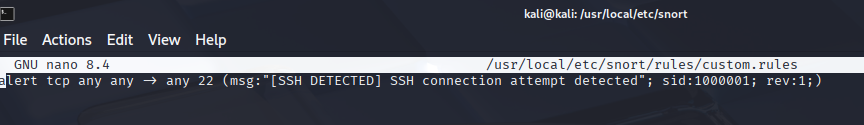

5. Opening the Snort Configuration File
We open snort.lua to link our new rule file.

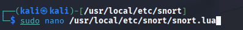

6. Modifying the IPS Section
We edit the ips block in the .lua config to load our custom rule.

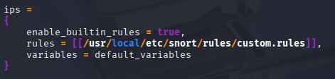

7. Testing the Lua Configuration
We validate the configuration with Snort’s test mode.

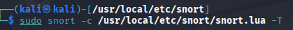

8. Identifying the Interface for Snort
We identify the correct interface (eth1) where Snort should listen.

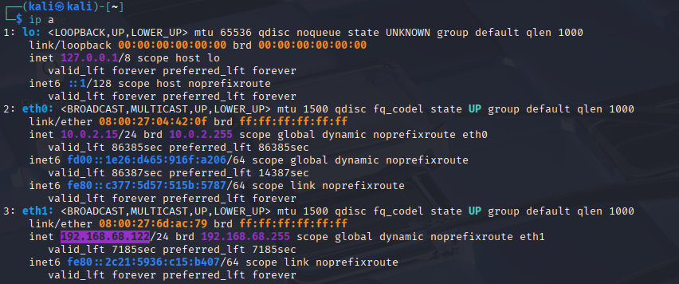

9. Starting Snort in IDS Mode
We launch Snort using the .lua configuration on the selected interface.

10. Initiating SSH Connection for Detection
An SSH connection attempt is initiated from the attacker machine to test the rule.

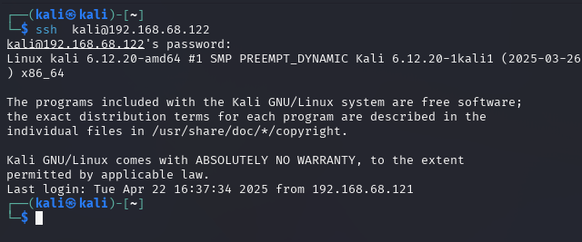

---

## 👤 Author

This repository was created during the **TryHackMe SOC1 path** to demonstrate real-world IDS deployment from scratch.

Feel free to fork, contribute, or reach out!

⭐ **Star the repo** if this helped you set up your own Snort lab!
